  

  <picture>
    <source media="(prefers-color-scheme: dark)" srcset="assets/tagline-dark.svg" />
    
  </picture>

  
  
  
  

 

  <picture>
    <source media="(prefers-color-scheme: dark)" srcset="assets/heading-now-dark.svg" />
    
  </picture>

<table>
  <tr>
    <td width="46%" valign="top">
      
      <h3>🌊 Team Chinmaya AUV</h3>
      <b>Team Lead</b> · Oceanic AI Centre, CVV 
      
We build autonomous underwater vehicles for the <b>Singapore AUV Challenge</b>. I work on the vision, sensor fusion and Pixhawk-based navigation.

      
      
      
      
        
      🎓 B.Tech CSE · Chinmaya Vishwa Vidyapeeth · Class of 2027
    </td>
    <td width="54%" valign="top">
       
      <b>🤖 Robotics Intern</b> · Oceanic AI Centre, CVV 
      Underwater computer vision with OpenCV + YOLOv8n, PyMAVLink control, depth/IMU sensor fusion.
        
       
      <b>💼 Project Intern</b> · Nvish Solutions (remote) 
      Backend APIs, AI-assisted development workflows and enterprise QA.
    </td>
  </tr>
</table>

 

  <picture>
    <source media="(prefers-color-scheme: dark)" srcset="assets/heading-work-dark.svg" />
    
  </picture>

<table>
  <tr>
    <td width="25%" valign="top" align="center">
       
      <h3>🤿 Dhruva & Pragna</h3>
      Autonomous underwater vehicles for SAUVC. YOLOv8n vision, sensor fusion, Pixhawk navigation.
        
      <a href="https://github.com/cvv-sauvc/SAUVC2026"><b>View repo ↗</b></a>
    </td>
    <td width="25%" valign="top" align="center">
       
      <h3>🚌 Vahan Mitra</h3>
      Real-time college bus tracking. Custom GPS module → MQTT → FastAPI → Flutter app.
        
      <a href="https://github.com/LUNAxKRISHNA/Vahan_Mitra"><b>View repo ↗</b></a>
    </td>
    <td width="25%" valign="top" align="center">
       
      <h3>📦 Loopit</h3>
      Inter-campus parcel dispatch with QR handovers, live status and push notifications.
        
      <a href="https://github.com/LUNAxKRISHNA/loopit"><b>View repo ↗</b></a>
    </td>
    <td width="25%" valign="top" align="center">
       
      <h3>📄 IEDC DocGen</h3>
      Template-driven document generation with secure, role-based access.
        
      <a href="https://github.com/LUNAxKRISHNA/IEDC_DocGen"><b>View repo ↗</b></a>
    </td>
  </tr>
</table>

 

  <picture>
    <source media="(prefers-color-scheme: dark)" srcset="assets/heading-toolkit-dark.svg" />
    
  </picture>

  

 

  <picture>
    <source media="(prefers-color-scheme: dark)" srcset="assets/heading-activity-dark.svg" />
    
  </picture>

<table>
  <tr>
    <td align="center" valign="middle">
      <picture>
        <source media="(prefers-color-scheme: dark)" srcset="https://github-readme-stats.vercel.app/api?username=LUNAxKRISHNA&show_icons=true&hide_rank=true&hide_border=true&bg_color=00000000&title_color=F28482&icon_color=84A59D&text_color=E6EDF3" />
        
      </picture>
       
      <picture>
        <source media="(prefers-color-scheme: dark)" srcset="https://github-readme-stats.vercel.app/api/top-langs/?username=LUNAxKRISHNA&layout=compact&hide_border=true&bg_color=00000000&title_color=F28482&text_color=E6EDF3" />
        
      </picture>
    </td>
    <td align="center" valign="middle">
      <picture>
        <source media="(prefers-color-scheme: dark)" srcset="https://raw.githubusercontent.com/LUNAxKRISHNA/LUNAxKRISHNA/output/survey-dark.svg" />
        
      </picture>
    </td>
  </tr>
</table>

  

Let's build something impactful → <a href="mailto:krishnak535@outlook.com">krishnak535@outlook.com</a>

